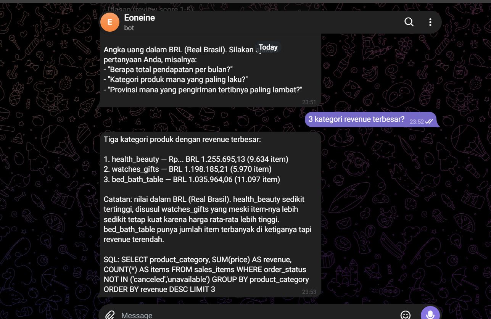

# Data Analyst Bot

Bot Telegram yang menjawab pertanyaan ad-hoc seputar data e-commerce Olist (Brazil). Pertanyaan bahasa natural diterjemahkan menjadi query SQL, dijalankan di PostgreSQL (Supabase), lalu hasilnya dikirim balik lengkap dengan SQL yang dipakai.

## Demo

Contoh tanya jawab langsung di Telegram. Perhatikan bahwa setiap jawaban selalu menyertakan query SQL-nya, sehingga angkanya bisa diverifikasi.



## Workflow

Workflow n8n lengkap link [https://eoneine.app.n8n.cloud/workflow/MBf2JJ9qdFhrXv2g] atau import (olist-analyst-bot.json).
Cara pakai: di n8n, klik menu **Import from File**, pilih file tersebut, lalu isi credential sendiri.

## Background

Seorang data analyst biasanya sedang fokus di project utama (dashboard, modeling, analisis mendalam). Lalu masuk ad-hoc request dari stakeholder, misalnya "revenue bulan lalu berapa?" atau "berapa persen order yang telat kirim?". Pertanyaannya kelihatan kecil, tapi analyst harus berhenti, membuka database, menulis query, lalu membalas, dan setelah itu butuh waktu lagi untuk kembali fokus.

## Kenapa Perlu Diotomatisasi

- **Context switching mahal.** Interupsi 5 menit bisa menghabiskan fokus jauh lebih lama.
- **Pertanyaan repetitif.** Polanya sama (total penjualan, top kategori, waktu pengiriman, jumlah customer), hanya filternya yang berbeda.
- **Analyst jadi bottleneck.** Stakeholder menunggu, keputusan bisnis jadi lambat.
- **Definisi metrik bisa melenceng.** Kalau dijawab manual, "revenue" bisa dihitung dengan atau tanpa freight, dan "customer" bisa dihitung per `customer_id` atau `customer_unique_id`.
- **Tidak ada jejak.** Jawaban lewat chat tidak terdokumentasi dan sulit diaudit.

## Cara Kerja

```
Telegram  ->  n8n (AI Agent: Groq + Qwen)  ->  Supabase (PostgreSQL, read-only)
                     |
                     +->  Jawaban + SQL dikirim ke Telegram
                     +->  Log ke Google Sheets (validation monitor)
```

1. Stakeholder mengirim pertanyaan ke bot Telegram.
2. Workflow n8n meneruskan pertanyaan ke AI Agent.
3. Agent (model Qwen lewat Groq) menulis query SELECT dan menjalankannya lewat tool `run_sql`.
4. Jawaban dikirim balik ke Telegram beserta SQL yang dipakai.
5. Pertanyaan, jawaban, dan SQL dicatat ke Google Sheets untuk dievaluasi.

## Tech Stack

| Komponen | Tools |
|---|---|
| Interface | Telegram Bot |
| Orkestrasi | n8n |
| LLM | Qwen via Groq |
| Database | Supabase (PostgreSQL) |
| Logging | Google Sheets |
| Dataset | [Brazilian E-Commerce Public Dataset by Olist (Kaggle)](https://www.kaggle.com/datasets/olistbr/brazilian-ecommerce) |

## Struktur Repo

```
olist-analyst-bot/
├── README.md
├── olist-analyst-bot.json    # export workflow n8n
└── demo.png     # screenshot demo
```

## Dataset

Data transaksi e-commerce Olist dari Brazil, sekitar 100 ribu order dari September 2016 sampai Oktober 2018. Karena datanya historis, bot tidak memakai `NOW()` atau `CURRENT_DATE`. Untuk pertanyaan seperti "bulan ini" atau "terbaru", bot memakai akhir periode data dan menyebutkannya di jawaban. Data 2016 dan Sep-Okt 2018 jumlahnya sedikit, jadi tren di periode itu kurang bisa diandalkan.

## Supabase: Setup dan Pengamanan

Supabase dipakai sebagai database PostgreSQL (plan Free, region Singapore). Karena bot menjalankan SQL yang dibuat oleh LLM, akses ke database sengaja dibatasi:

- **Role khusus read-only.** Bot terhubung memakai role `bot_readonly`, bukan role admin. Credential-nya tersimpan di n8n (`supabase-bot-readonly`), tidak ditulis di workflow atau repo.
- **Hanya lewat view.** Bot hanya diarahkan ke tiga view yang sudah disiapkan: `sales_items`, `orders_enriched`, dan `customers`. Definisi metrik (revenue, customer, keterlambatan) ditanam di view dan system prompt, jadi jawabannya konsisten.
- **Hanya SELECT.** Aturan ini ada di dua lapis: di system prompt, dan di level permission role database. Jadi kalaupun LLM salah menulis query, database tetap menolak operasi selain baca.
- **Password dikelola terpisah.** Password dibuat kuat tanpa karakter yang merusak connection string (`@ : / # ? %`) dan bisa direset kapan saja lewat `ALTER ROLE`.
- **Koneksi terenkripsi.** SSL diaktifkan saat koneksi dari n8n ke Supabase.

### Troubleshooting koneksi n8n ke Supabase

| Error | Penyebab dan solusi |
|---|---|
| `self-signed certificate in certificate chain` | n8n menolak rantai sertifikat SSL Supabase. Nyalakan **Ignore SSL Issues** untuk prototipe, atau pakai sertifikat CA Supabase untuk penggunaan serius. |
| `password authentication failed` | Password di n8n tidak sama dengan password role. Reset dengan `ALTER ROLE` dan ketik ulang tanpa spasi. |
| `Tenant or user not found` | Ada typo di bagian user atau host. |
| `Connection refused` | Cek Port (5432), SSL, dan pastikan SSH Tunnel mati. Alternatifnya pakai Transaction pooler di port 6543, aman untuk query SELECT. |

## Aturan Bot

- Selalu menjalankan query sebelum menyebut angka, tidak boleh menebak.
- Revenue = `SUM(price)` tanpa freight dan tanpa order `canceled` atau `unavailable`.
- Customer dihitung dengan `COUNT(DISTINCT customer_unique_id)`.
- Mata uang BRL.
- Pertanyaan yang tidak bisa dijawab dari data (profit, biaya, perilaku website, data real-time) ditolak dengan jelas.
- Setiap jawaban menyertakan SQL yang dipakai.

## Validation Monitor

Setiap interaksi dicatat ke Google Sheets (`log_id`, timestamp, chat_id, pertanyaan, jawaban bot, SQL). Analyst bisa mereview kualitas jawaban kapan saja untuk melihat di mana bot bisa dipercaya dan di mana belum.

## Batasan

Bot ini menangani pertanyaan yang jelas dan berulang, bukan pengganti analyst. Analisis yang butuh interpretasi, konteks bisnis, atau kajian mendalam tetap perlu dikerjakan manusia. Sebagai LLM, bot juga masih bisa membuat kesalahan kecil di format jawaban (misalnya simbol mata uang), sehingga validation monitor tetap diperlukan.

## Rencana Pengembangan

- Menyimpan klik tombol PASS/FAIL dari Telegram ke kolom `user_feedback` di Google Sheets, supaya akurasi bot bisa diukur dari feedback user.
- Membatasi akses bot hanya ke chat ID yang diizinkan.
- Menambah aturan format di system prompt (misalnya penulisan mata uang) berdasarkan temuan dari validation monitor.

## Menjalankan Project

1. Download dataset dari Kaggle dan import ke Supabase.
2. Buat tiga view (`sales_items`, `orders_enriched`, `customers`) dan role `bot_readonly` dengan akses SELECT saja.
3. Import `olist-analyst-bot.json` ke n8n.
4. Isi credential: Telegram, Groq, Postgres (Supabase), dan Google Sheets.
5. Aktifkan workflow dan kirim pertanyaan ke bot.
